# HANGMAN-X.com 

[View the live site here](https://lukaszkukla)

[GitHub](https://github.com/lukaszkukla/hangman-x)

# Goal of this project
Welcome to HANGMAN-X. This is na interactive game which runs in Python terminal. It was built using Code Institute [terminal template](https://github.com/Code-Institute-Org/python-essentials-template) which runs in web browser and deployed on Heroku. 

It is a third project on my journey with [Code Institute](https://codeinstitute.net/ie/) to become a fullstack web developer. It is intended to put my knowledge into practice.

[Hangman game](https://en.wikipedia.org/wiki/Hangman_(game)#:~:text=Though%20the%20origins%20of%20the,to%20fill%20in%20the%20blanks.) requires user to guess the secret word by guessing the individual letters. Users have 6 attempts per word to beat the game before they will be 'hanged'.

My version of the game calls for random word via API. Game continues until user stops, loose all lives or resign.

For the purpose of testing its functionality user may enter word 'cheat' to get a hint of the hidden word. This functionality is only for [Code Institute](codeinstitute.com) the grading purposes.

# Table of contents

* [UX](#ux "UX")
    * [User goals](#user-goals "User goals")
    * [User stories](#user-stories "User stories")
    * [User requirements and expectations](#user-requirements-and-expectations "user requirements and expectations")
         * [Requirements](#requirements "Requirements")
         * [Expectations](#expectations "Expectations")
         * [Flow chart](#flow-chart "Flow chart")
     * [Design choices](#design-choices "Design choices")
        * [Fonts](#fonts "Fonts")
        * [Colors](#colors "Colors")
    * [Wireframes](#wireframes "Wireframes")
    * [Features](#features "Features")
        * [Existing features](#existing-features "Existing features")
            * [Main game](#main-game "Main game")           
        * [Future developments](#future-developments "Future developments")
    * [Technologies used](#technologies-used "Technologies used")
        * [Languages](#languages "Languages")
        * [Libraries and frameworks](#libraries-and-frameworks "Libraries and frameworks")
        * [Tools](#tools "Tools")
    * [Testing](#testing "Testing")
        * [Images](#images "Images")
        * [During testing](#during-testing "During testing") 
        * [Unfixed bugs](#unfixed-bugs "Unfixed bugs")        
    * [Deployment](#deployment "Deployment")
        * [Heroku](#Heroku-deployment "Heroku deployment")
    * [Cloning repository](#cloning-repository "Cloning repository")
    * [Credits](#credits "Credits")
    
# UX

## User goals
* Intuitive and responsive to user's interaction
* Easily navigated around
* High scores should be stored and accessible to other users to view it

## User stories
As a user, I want to:
* See welcome page with menu option
* Know how the game works (how to)
* See list of 10 best players
* See my score
* Stop game at any time
* Track number of correct guessed words
* See the final score upon game completion

## User requirements and expectations

### Requirements
* Fetch data from [google sheets](https://docs.google.com/spreadsheets/d/1jcsqlHpeQ3zNnlo41blYo2_BDiXg_OEw_oLaPTjD4dM/edit?usp=sharing) - read only access
* Randomise questions on reload
* Visually neat and tidy design

### Expectations
* I expect game to function without any errors
* I expect clear and simple navigation
* I expect appropriate response to user inputs
* I expect words to not to repeat over and over

## Flow chart
In order to meet above requirements and expectations I built flowchart which served me as a road map to successfull completion of the project:

\
&nbsp;
[back to top](#table-of-contents)
\
&nbsp;

## Design choices

### Fonts
I used [Google Fonts](https://fonts.google.com/ "Google Fonts"). The font used for the entire website is [Poppins](https://fonts.google.com/specimen/Roboto+Slab?query=rob "Poppins"). 

### Colors

 
 * RED = '\033[91m'
 * VIOLET = '\033[95m'
 * BLUE = '\033[94m'
 * CYAN = '\033[96m'
 * GREEN = '\033[92m'
 * YELLOW = '\033[93m'    
 * ORANGE = '\001[32;1m'
 * WHITE = '\033[0m'
 * BOLD = '\033[1m'
 * UNDERLINE = '\033[4m'

\
&nbsp;
[back to top](#table-of-contents)
\
&nbsp;

# wireframes
I use [diagrams.net](https://www.diagrams.net/ "diagrams.net") to develop wireframes for the website. 

The wireframe of pages below:

* Game screen wireframes
\
&nbsp;

\
&nbsp;
[back to top](#table-of-contents)
\
&nbsp;

# Features

## Welcome screen
User can access four options from the welcome screen:
1. Start the game
1. How to play
1. Hall of fame
1. Quite game

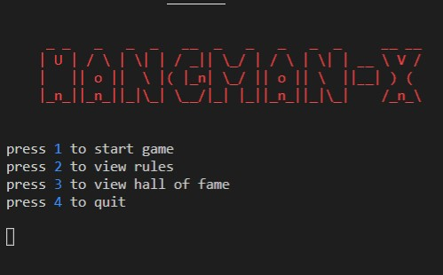

### Welcome screen error handling
* User must enter 1 of the 4 options anything else will trigger warning message

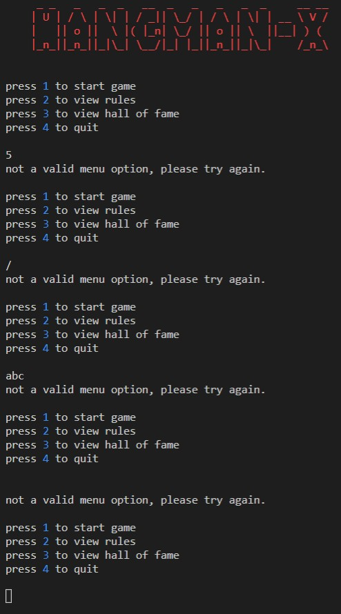

### Rules
The rules display information on how game works and wait for user input 'press ENTER to continue...' to get back to main menu.

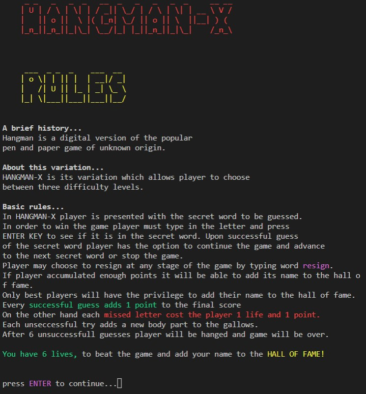

### Gameplay
- Player is prompted to enter its name at the start of the game 
- Guess word is picked randomly via API call to [Random word API](https://random-word-api.herokuapp.com/home "Random word API"), masked and displayed to user as string of '_' underscores 
- User must enter letters to guess the first and subsequent hidden letters in the game
- User advances to the next word when all the letters of current word has been revealed
- Game ends when:
    - User runs out of tries
    - User choose to not continue after successful word guess
    - User types *'resign'* at any stage during the game
- keyword *'resign'* completes the game in its current state and adds user to the hall of fame if enough points accumulated
- Only the user who accumulates enough points will get an honour to be added to the hall of fame

#### Scoring system
* Each successfuly guessed letter adds 1 point to the final score
* Guessing the whole word add 10 points to the player's score
* Each unsuccessful try cost player 1 point

#### Tries
Player starts game with 6 lives. Each successful guess saves user from losing a life.
Each unsuccessful try will decrease user's life by 1 point and add a body part to the gallows:

* Initial state

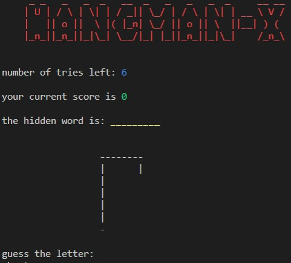

* Head

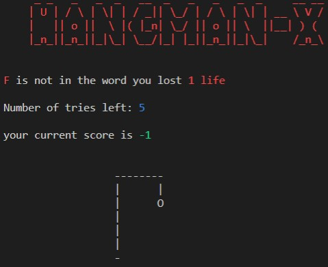

* Head and torso

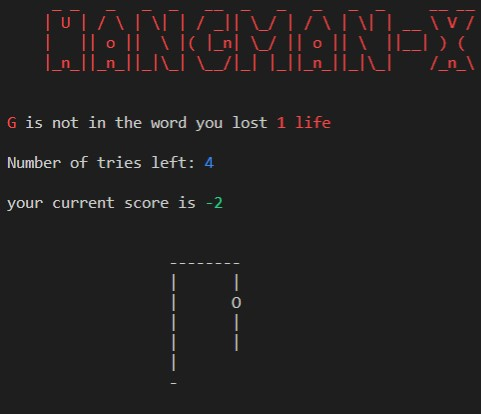

* Head, torso, and one arm

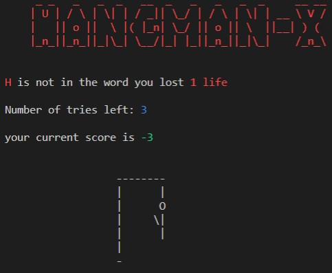

* Head, torso, and both arms

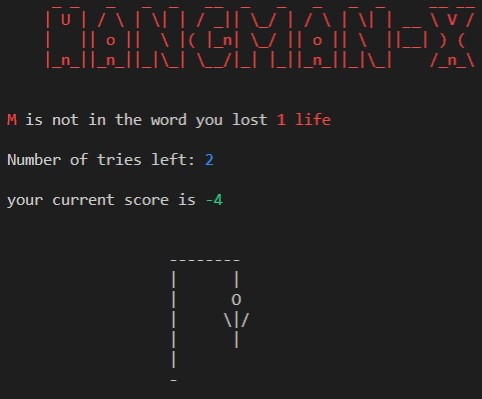

* Head, torso, both arms, and one leg

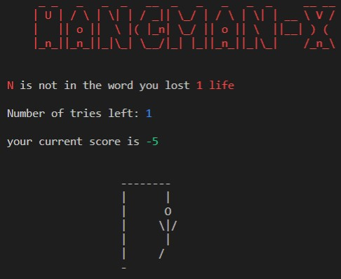

* Final state: head, torso, both arms, and both legs

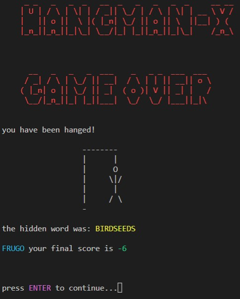

#### error handling
- user can only enter letters, numbers and special characters are not allowed and will prompt the user:

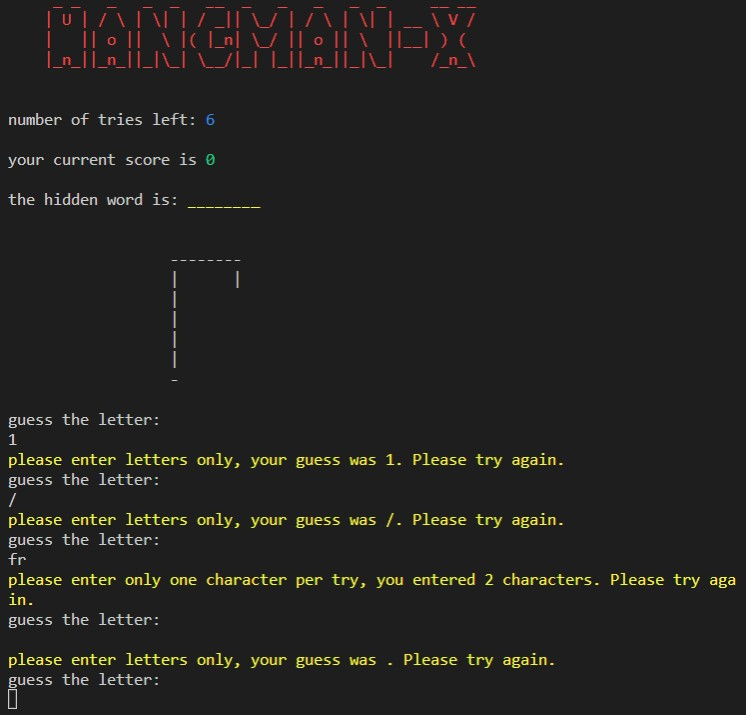
\
&nbsp;

[back to top](#table-of-contents)
\
&nbsp;

## future developments
* Allow user to sacrifice some points to reveal 1 random letter per word
* Make it more visually appealing with Colorama library

\
&nbsp;
[back to top](#table-of-contents)
\
&nbsp;

# technologies used

## languages
* [HTML](https://en.wikipedia.org/wiki/HTML "HTML")
* [CSS](https://en.wikipedia.org/wiki/CSS "CSS")
* [Python](https://www.python.org/ "Python")

## libraries and frameworks
* [Google Fonts](https://fonts.google.com/ "Google Fonts")
* [Font Awesome library](https://fontawesome.com/ "Font Awesome")

## tools
* [Gitpod](https://www.gitpod.io/ "Gitpod")
* [Github](https://www.github.com/ "Github")
* [diagrams.net](https://diagrams.net/ "diagrams.net")
* [W3C HTML Validation Service](https://validator.w3.org/ "W3C HTML")
* [W3C CSS Validation Service](https://jigsaw.w3.org/css-validator/ "W3C CSS")
* [PEP8](http://pep8online.com/ "Python Validator")
* [Autoprefixer](https://autoprefixer.github.io/ "Autoprefixer")
* [Lighthouse](https://developers.google.com/web/tools/lighthouse "Lighthouse")
* [Text to ASCII generator](http://patorjk.com/software/taag/ "taag")
* [Enchanted Learning](https://www.enchantedlearning.com/wordlist/ "word lists")
* [Vecteezy](https://www.vecteezy.com/ "vecteezy")
* [WebFX](https://www.webfx.com/web-design/color-picker/F1F1F1/ "WebFX color scheme generator")
* [TinyPNG](https://tinypng.com/ "TinyPNG")
* [Photoshop](https://www.adobe.com/ie/products/photoshop.html "Adobe Photoshop")

\
&nbsp;
[back to top](#table-of-contents)
\
&nbsp;

# testing

I used print statements for every piece of code that I worked on to test if it is performing as expected. Any bugs were corrected 'on the fly' while building the app

### Markup Validation
I tested my application with [W3C Markup Validation Service](https://validator.w3.org/ "Markup validation service").

### CSS Validation
Subsequently validated my css styles using [W3C CSS Validation Service](https://jigsaw.w3.org/css-validator/ "W3C CSS Validation Service").

### Python Validation
Python code was validated using 

### Accessibility Validation
Accessibility test was done via [experte.com](https://www.experte.com/accessibility "accessibility testing").

.

### Lighthouse

Final testing was performed by Google's [Lighthouse](https://developers.google.com/web/tools/lighthouse "lighthouse")

### Images
All images on the website were compressed using [TinyPNG](https://tinypng.com/ "tinypng.com for image compression")

\
&nbsp;
[back to top](#table-of-contents)
\
&nbsp;

## Unfixed bugs
Games is not responsive. It is not recommended to play on mobile devices. The Code Institute's Python terminal emulator is not build to be scaled down to fit small screens

\
&nbsp;
[back to top](#table-of-contents)
\
&nbsp;

# Deployment
## Heroku deployment  
  
The project was deployed to [Heroku](https://www.heroku.com) using the below procedure:-    
  
1. Log in to [Heroku](https://id.heroku.com/login) or [sign up](https://signup.heroku.com/login) for free account
1. Click **new** button in the top right corner
1. Select **create new app** from the drop down list
1. Enter a unique app name in the 'App name' input field - green thick will appear to confirm availability
1. Select appropriate **region** to your location from the 'choose a region' drop down list
1. Click **create app** button to proceed
1. 'Deploy' tab will be shown. scroll down to the **config vars** section in the **settings** tab
1. Click **reveal config vars** button
1. Enter **PORT** in the 'KEY' field
1. Enter **8000** in the 'VALUE' filed
1. Click the **add** button
1. Below, in the **buildpacks** section click **add buildpack** button
1. Type and select 'Python' and click 'save changes' button
1. Repeat above step to add 'node.js' pack
\
&nbsp;
   * **IMPORTANT** The buildpacks **must** be in this **particular order**. If they are not, then click and drag to change it
   \
&nbsp;
1. Select **Github** as the deployment method from the **deploy tab**
1. Connect to Github to confirm
1. Type repository name and click **search** button
1. Click **connect** button that appeared next to your repository name
1. Select your preferred deployment type:
   * 'Enable Automatic Deploys' for automatic deployments when you push updates to Github - NOT RECOMMENDED if you have a free account  
   * 'Deploy Branch' for manual deployments - RECOMMENDED for free account users

## Gitpod terminal or local machine
This project was developed using Code Institute's [template](https://github.com/Code-Institute-Org/python-essentials-template) which simulates a terminal in the web browser.
Due to this, I optimized the game to work via the [final Heroku deployment](https://dnlbowers-battleship.herokuapp.com/), and I do not recommend playing it locally. That said, I have included this section to give you a choice.  

1. Navigate to the [GitHub repository](https://github.com/dnlbowers/battleships), and follow [these steps to clone the project](https://docs.github.com/en/repositories/creating-and-managing-repositories/cloning-a-repository) into your IDE of choice.   
   
   * **Gitpod** only **requires** you to have the **web extension** installed and **click** the **green Gitpod button** from the repositories main page. If you are **using Gitpod** please **skip step 2** below as you do not require a virtual environment to protect your machine.  
  
1. **Create** the **virtual environment** with the terminal command **"python3 -m venv venv".** Once complete add the "venv" file to you're ".gitignore" file and use the terminal command **"venv\Scripts\activate.bat" to activate it.**
   
   * ***IMPORTANT*** If developing locally on your device, ensure you **set up/activate the virtual environment before installing/generating the requirements.txt file**; failure to do this will pollute your machine and put other projects at 
 
1. **Install the requirements** listed in requirements.txt using the terminal command  **"pip3 install -r requirements.txt"**
   * Kindly note that since I developed the project from scratch and installed the required libraries as progressed **I have already included a requirements.txt for this app** by using the terminal command **"pip3 freeze > requirements.txt"** to generate it.

\
&nbsp;
[back to top](#table-of-contents)
\
&nbsp;

# credits

* [Simen Daehlin](https://github.com/Eventyret "Simen Daehlin") - for code inspiration, help and advice

* [Sam Timmins](https://github.com/sam-timmins/T4Tri-triathlon-club "Sam Timmins") - for readme template, structure and some ideas that sparked from using it

* Peer community on [Code Institute](https://codeinstitute.net/ie/) Slack channel

* Kasia_ci from [Code Institute](https://codeinstitute.net/ie/) - for keeping up the spirit and leading weekly standups

\
&nbsp;
[back to top](#table-of-contents)
\
&nbsp;